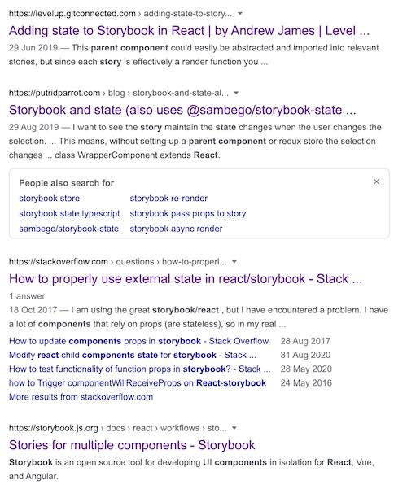
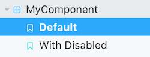
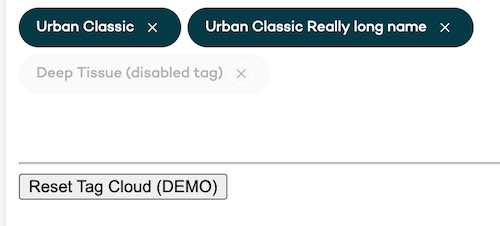

[Storybook](https://storybook.js.org/) is a fantastic tool for developing, maintaining and sharing UI components. It's been around a while now and at the time of writing was at version 6.1. I have been spending a fair bit of time recently porting a lot of our own internal UI components at Urban into a distributable self contained UI components package as we seek to unify our style guide / design library and UI components across all our apps and web platforms.

One of the most valuable outcomes of using a tool like Storybook is allowing other non development staff in your company to be able to access, test and use your components in isolation, in our example they can use it like a reference guide for creating new marketing pages or we can communicate easily with the design team to let them test out different colour schemes with multiple predefined states. 

One of the small hurdles you'll encounter here though is when your component relies on some sort of parent state, such as an input field that relies on a value being updated in a parent component via an onChange/value prop combination. Without this parent state it can be hard to communicate how some of your components work to your team.

As with all popular tools over time as their ways of doing things or their API's change it can become time consuming trying to find the correct answer to any of your queries on Stack Overflow or the multitude of other links. This is true of Storybook too, there's a lot of information on how to add stories and add parent components to your stories etc but usually it's using the old style stories.



Everyone of those links above uses the old `storiesOf` method which isn't the current way of writing a Storybook story.

## How to add parent state to a React component story

Well it's still extremely easy to add a parent state to your stories, not that much different from previous.

To add a story you'll be familiar with this pattern below

```jsx
import React from 'react';
import { Story } from '@storybook/react';
import { GlobalStyle } from '../Theme/b2c-theme';
import MyComponent, { MyComponentProps } from './MyComponent';


export default {
  component: MyComponent,
  decorators: [
    (Story: Story) => (
      <>
        <GlobalStyle />
        <Story />
      </>
    ),
  ],
  title: 'MyComponent',
};

const Template = (args: MyComponentProps) => <MyComponent {...args} />;

export const Default = Template.bind({});
Default.args = {};
Default.parameters = {
  jest: ['MyComponent'],
};

export const WithDisabled = Template.bind({});
WithDisabled.args = {
  disabled: true,
};
WithDisabled.parameters = {
  jest: ['MyComponent'],
};
```

You'll create a Template function that returns your component and passes its args down as props. Then by using `Template.bind` you can apply your different states, in the example above we have a default state and a disabled state this would give you the following structure



So you may have spotted it already but your Template variable is essentially a parent component. It takes an arguments object (props) and returns a component so there's no reason why you can't add to this and manage state internally within this template component.

## TLDR - Show an example

For this example we'll be looking at a tagCloud component in the Urban UI library, you can see the [tagCloud component here](https://urbanmassage.github.io/component-library/?path=/story/tagcloud--default). The parent state is required to allow us to pass a list of Tag elements to our tagCloud and keep that list up to date as elements are removed or the story is reset.



Our Tag cloud component is essentially just a wrapping div for style purposes that takes multiple elements as children and renders them 

```jsx
// TagCloud.tsx
import React, { ComponentPropsWithRef, FC } from 'react';
import styled from 'styled-components';

const TagCloudElement = styled.div`
  // ...snip
`;

export interface TagCloudProps extends ComponentPropsWithRef<'div'> {}

const TagCloud: FC<TagCloudProps> = (props) => {
  const defaultProps = {} as Readonly<TagCloudProps>;

  const { children, ...rest } = {
    ...defaultProps,
    ...props,
  };

  return <TagCloudElement {...rest}>{children}</TagCloudElement>;
};

export default TagCloud;
```

We pass Tag elements as children to our TagCloud component

```jsx
// Tag.tsx
import React, { FC } from 'react';
import styled from 'styled-components';
import { IconColorThemes, IconSizes } from '../Icons/ArrowRight/ArrowRight';
import Cancel from '../Icons/Cancel/Cancel';
import { colors } from '../Theme/theme';
import Typography, { TypeVariants } from '../Typography/Typography';

const TagElement = styled.button`
  // ...snip
`;

const TagIcon = styled.i`
  // ...snip
`;

export interface TagProps {
  assistiveIconLabel: string;
  disabled?: boolean;
  onClick: (event: React.MouseEvent<HTMLButtonElement>) => void;
  text: string;
  resourceId: string;
}

const Tag: FC<TagProps> = (props) => {
  const defaultProps = {
    assistiveIconLabel: 'dismiss',
    disabled: false,
  } as Readonly<TagProps>;

  const { assistiveIconLabel, disabled, onClick, text, resourceId, ...rest } = {
    ...defaultProps,
    ...props,
  };

  return (
    <TagElement
      data-testid="tag-element"
      disabled={disabled}
      onClick={onClick}
      type="button"
      data-uniqueid={resourceId}
      {...rest}
    >
      <Typography
        align="left"
        data-testid="tag-text"
        theme={disabled ? 'primary' : 'white'}
        variant={TypeVariants.bodySmall}
        component={TypeVariants.span}
      >
        {text}
      </Typography>
      <TagIcon aria-label={assistiveIconLabel} data-testid="tag-icon">
        <Cancel
          color={disabled ? IconColorThemes.default : IconColorThemes.white}
          size={IconSizes.xSmall}
        />
      </TagIcon>
    </TagElement>
  );
};

export default Tag;
```

So our non interactive story for our tag cloud may look like this

```jsx
// TagCloud.stories.tsx
const Template = (args: TagCloudProps) => <TagCloud {...args} >
  <Tag />
  <Tag />
</TagCloud>;
```

But we want to be able to remove elements from our tag cloud to show our library users how our component reacts and also to let them reset the demo once they have removed tags.

As described above this is extremely simple

```jsx
// TagCloud.stories.tsx

import React, { useState } from 'react';

import { Story } from '@storybook/react';

import { GlobalStyle } from '../Theme/theme';
import TagCloud, { TagCloudProps } from './TagCloud';
import Tag, { TagProps } from '../Tag/Tag';

export default {
  component: TagCloud,
  decorators: [
    (Story: Story) => (
      <>
        <GlobalStyle />
        <Story />
      </>
    ),
  ],
  argTypes: {
    assistiveIconLabel: {
      control: {
        type: 'string',
      },
    },
    disabled: {
      control: {
        type: 'boolean',
      },
    },
    text: {
      control: { type: 'text' },
    },
    resourceId: {
      control: { type: 'text' },
    },
  },
  subComponents: { Tag },
  title: 'TagCloud',
};

const defaultProps = [
  {
    assistiveIconLabel: 'test1',
    text: 'Urban Classic',
    resourceId: '1234',
  },
  {
    assistiveIconLabel: 'test1',
    text: 'Urban Classic Really long name',
    resourceId: '5678',
  },
  {
    assistiveIconLabel: 'test1',
    disabled: true,
    text: 'Deep Tissue (disabled tag)',
    resourceId: '9011',
  },
] as TagProps[];

const Template = (args: TagCloudProps) => {
  const [elements, setElements] = useState(defaultProps);

  const removeElement = (event: React.BaseSyntheticEvent) => {
    const { dataset } = event.currentTarget;

    setElements(
      elements.filter((element) => element.resourceId !== dataset.uniqueid),
    );
  };

  const resetElements = () => {
    setElements(defaultProps);
  };

  return (
    <>
      <TagCloud>
        {elements.map(
          ({
            assistiveIconLabel,
            disabled,
            text,
            resourceId,
          }: TagProps & { key: string }) => (
            <Tag
              assistiveIconLabel={assistiveIconLabel}
              disabled={disabled}
              key={resourceId}
              text={text}
              resourceId={resourceId}
              onClick={removeElement}
            />
          ),
        )}
      </TagCloud>
      <hr style={{ marginTop: '5rem' }} />
      <button onClick={resetElements}>Reset Tag Cloud (DEMO)</button>
    </>
  );
};

export const Default = Template.bind({});
Default.args = {};

Default.parameters = {
  jest: ['TagCloud'],
};
```

So there we have it, you add some hooks to your Template component as you would build any normal React component and storybook will render your story and allow you to interact with your component in a more meaningful way to really showcase how your components work.

You can try this for yourself [here](https://urbanmassage.github.io/component-library/?path=/story/tagcloud--default)