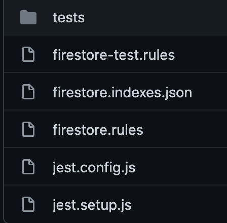

This post is the second post in a two part look at Firebase Cloud Firestore security rules and how to unit test them. You can find part one at [Firebase Cloud Firestore security rules - Part one - Writing the rules](https://dpurdy.me/blog/firebase-cloud-firestore-security-rules/)

## Setting up

As in the previous article I'll be making the assumption that you already have your development environment setup and the ability to run the Firebase Firestore emulator which you'll need in order to run your tests. We'll also be assuming that all of your Firestore rules and tests etc will be stored in a `firestore` folder at the root of your project.

You can find a repository with all the rules and the full suite of tests on [Github](https://github.com/DanPurdy/firebase-firestore-rule-testing-demo). We wont be covering every single test case for every single rule we wrote but this article should give you a head start and an understanding of some of the basics.

We'll be using Jest as our test runner. We'll also need to install the firebase rule testing package and the jest-environment-node package

```editorconfig
npm i --save-dev jest jest-environment-node @firebase/rules-unit-testing
```

Some of the tests may take a while to execute so it's a good idea to up the jest timeout, you can set this easily by creating a `jest.setup.js` file at the root of your firestore folder.

```javascript
jest.setTimeout(20000);
```

You then setup a `jest.config.js` file to make sure your tests are running in the correct environment and that the timeout settings above are loaded.

```javascript
module.exports = {
  testEnvironment: 'node',
  setupFilesAfterEnv: ['./jest.setup.js'],
};
```

You should already have your `firestore.rules` file adjacent to these two. 


We're going to need to set default or dummy data into our Firestore emulator before many of our tests and we dont want to have to do that with our locked down rules in place, it would be much easier if we could pass a completely unrestricted ruleset to our Firestore emulator while we load in our test data and then apply our rules that we want to test and run in production before any of our actual test cases execute. Thankfully this is extremely easy and you can utilise the `loadFirestoreRules` method from the `@firebase/rules-unit-testing` package to load different rules as you wish. So lets create our unrestricted rules and then look at how we can use a simple pre test setup pattern to swap in these rules, enter our test data and then apply our production rules before our tests run. First though what does this unrestricted ruleset look like.

```javascript
rules_version = '2';
service cloud.firestore {
  match /databases/{database}/documents {
    match /{document=**} {
      allow read, write: if true;
    }
  }
}
```

Almost identical to the default deny-all wildcard matching rule that we used in our production rules except this time we permit all methods rather than restrict them. Save this file as `firestore-test.rules` inside the firestore folder too we'll come back to it in the next section. Finally create a `tests` folder and within that create a folder for each of y collections that will be tested.



### Setup and teardown helpers

In all of the tests you're going to want to initialise a test user, possibly some dummy data and the test app that tests will be run against and then straight after we'll need to teardown that user and the data to leave a fresh environment ready for our next tests. To aid this there are two simple setup methods we can create and subsequently use in all of our tests. 

First create a file called helpers.js at the root of your tests folder `/firestore/tests/helpers.js` and then copy and paste the following into the file.

```javascript
const { apps, initializeTestApp, loadFirestoreRules } = require('@firebase/rules-unit-testing');
const { readFileSync } = require('fs');

module.exports.setup = async (auth, data) => {
  const projectId = `rules-spec-${Date.now()}`;
  const app = await initializeTestApp({
    projectId,
    auth,
  });
 
  // Create and initialise an app reference
  const db = app.firestore();

  // Apply the test rules so we can write documents without needing the admin app
  await loadFirestoreRules({
    projectId,
    rules: readFileSync('firestore/firestore-test.rules', 'utf8'),
  });

  // Write all mock documents before production rules are applied
  if (data) {
    for (const key in data) {
      const ref = db.doc(key);
      await ref.set(data[key]);
    }
  }

  // Apply production rules to be tested
  await loadFirestoreRules({
    projectId,
    rules: readFileSync('firestore/firestore.rules', 'utf8'),
  });

  // Return the app reference
  return db;
};

module.exports.teardown = async () => {
  Promise.all(apps().map((app) => app.delete()));
};
```

The setup method above creates a test app with our auth options and then creates a reference to our Firestore instance, next it loads our unrestricted rules set and iterates over any dummy data we may have passed to our setup method, inserting it into our Firestore instance. Finally once all of our dummy data has been written we load and apply our actual ruleset that we created in [part 1](https://dpurdy.me/blog/firebase-cloud-firestore-security-rules/), finally returning the database reference. The teardown method is fairly self explanatory in that it just deletes all data from our Firestore database.

## Default ruleset tests

We previously wrote a default rule to ensure that any sort of extra collection we add without rules would be read and write protected, this should therefore definitely be the first place we test.

```javascript
// /firestore/tests/default.test.js
const { setup, teardown } = require('./helpers');
const { assertFails } = require('@firebase/rules-unit-testing');

describe('Default firestore rules', () => {
  let db;
  let ref;

  beforeAll(async () => {
    db = await setup();
    ref = db.collection('non-existsent-collection');
  });

  afterAll(async () => {
    await teardown();
  });

  test('fail when trying to read from an unauthorised store', async () => {
    expect(await assertFails(ref.get()));
  });

  test('fail when trying to write to an unauthorised store', async () => {
    expect(await assertFails(ref.add({})));
  });
});
```

Again, fairly self explanatory - set up a random collection and assert that both a get request and an add request fail.

Next let's test our `stores` collection, here's a reminder of the rules we have in place.

```javascript
match /stores/{storeId} {
  allow read: if true;
  allow create: if false;
  allow update: if isStoreStaff(storeId);
  allow delete: if false;
}
```

We'll start with the read/get rule. As it's open to everyone we more want to make sure that this remains readable to all types of users whether authenticated or not.

First let's make sure that non authenticated users can read from our stores collection.

```javascript
test('succeed when a non authenticated user tries to load a store', async () => {
  const db = await setup(null, {
    'stores/ST01': {
      name: 'test',
    }, 
  });
  const ref = db.collection('stores');

  expect(await assertSucceeds(ref.doc('ST01').get()));
});
```

We pass `null` to our auth options to represent an unauthenticated user and then pass a single default test store to our stores collection we then assert that you can successfully read from this collection. We'll do much the same in our next test to ensure that an authenticated user can also read from this collection, to test this we just make sure we pass a user/auth object to our setup function, it always makes sense to pass a uid property for a user object as we'll be using this in some future tests and normally you'll want to have rules where you check the user ID.

```javascript
test('succeed when a authenticated user tries to load a store', async () => {
  const db = await setup(
    {
      uid: 'user',
    },
    {
      'stores/ST01': {
        name: 'test',
      },
    },
  );
  const ref = db.collection('stores');

  expect(await assertSucceeds(ref.doc('ST01').get()));
});
```

Let's see that all together for the first test.

```javascript
const { setup, teardown } = require('../helpers');
const { assertSucceeds } = require('@firebase/rules-unit-testing');

describe('Stores read rules', () => {
  describe('get', () => {
    afterAll(async () => {
      await teardown();
    });

    test('succeed when a non authenticated user tries to load a store', async () => {
      const db = await setup(null, {
        'stores/ST01': {
          name: 'test',
        },
      });
      const ref = db.collection('stores');

      expect(await assertSucceeds(ref.doc('ST01').get()));
    });

    test('succeed when a authenticated user tries to load a store', async () => {
      const db = await setup(
        {
          uid: 'user',
        },
        {
          'stores/ST01': {
            name: 'test',
          },
        },
      );
      const ref = db.collection('stores');

      expect(await assertSucceeds(ref.doc('ST01').get()));
    });
  });
});
```

Next up we look at our store list rules, as we've made sure that our get and list rules are exactly the same by using the `read` keyword in the rules we can use very similar tests and expect the same output. The main difference between our list and get rules is obviously that one requires you to pass a specific resource ID whereas the list methods will just return you all the records in the collection.

```javascript
describe('list', () => {
    afterAll(async () => {
      await teardown();
    });

    test('succeed when a non authenticated user tries to get a list of all stores', async () => {
      const db = await setup(
        null,
        {
          'stores/ST01': {
            name: 'test1',
          },
        },
        {
          'stores/STO2': {
            name: 'test2',
          },
        },
      );
      const ref = db.collection('stores');

      expect(await assertSucceeds(ref.get()));
    });

    test('succeed when a authenticated user tries to load a list of stores', async () => {
      const db = await setup(
        {
          uid: 'user',
        },
        {
          'stores/ST01': {
            name: 'test1',
          },
        },
        {
          'stores/STO2': {
            name: 'test2',
          },
        },
      );
      const ref = db.collection('stores');

      expect(await assertSucceeds(ref.doc('ST01').get()));
    });
  });
```

The delete and create rules are both set to false and therefore it shouldn't be possible for any type of user, authenticated or not, to use these methods. 

```javascript
test('fail when a non authenticated user tries to delete a store record', async () => {
    const db = await setup(null, {
      'stores/ST00': {
        name: 'test',
      },
    });

    expect(await assertFails(db.collection('stores').doc('ST00').delete()));
  });

  test('fail when an authenticated user tries to delete a store record', async () => {
    const db = await setup(
      { uid: 'test' },
      {
        'stores/ST00': {
          name: 'test',
        },
      },
    );

    expect(await assertFails(db.collection('stores').doc('ST00').delete()));
  });
```

With the create rules there are two ways that a document can be added to a collection. Either you use the add method directly on the collection which would create a new record with a random document ID or you would use the doc method to specify an ID for the document and then the set method directly after that to update that document with the fields you want.

```javascript
// Create a store document with a random ID and a name property
.collection('stores').add({ name: 'test' })
```

or

```javascript
// Create a store document with the ID of test and a name property
.collection('stores').doc('test').set({ name: 'test' })
```

therefore we make sure to test for both these instances

```javascript
test('fail when a non authenticated user tries to create a store record', async () => {
  const db = await setup();

  expect(await assertFails(db.collection('stores').add({ name: 'test' })));
});

test('fail when a non authenticated user tries to create a store record', async () => {
  const db = await setup();

  expect(await assertFails(db.collection('stores').doc('test').set({ name: 'teegst' })));
});

test('fail when an authenticated user tries to create another store record with a random uid', async () => {
  const db = await setup({ uid: 'test' });

  expect(await assertFails(db.collection('stores').add({ name: 'teegst' })));
});

test('fail when an authenticated user tries to create a non random uid store record', async () => {
  const db = await setup({ uid: 'test' });

  expect(await assertFails(db.collection('stores').doc('test').set({ name: 'teegst' })));
});
```

Finally for the store records we need to make sure that only users that are 'admins' for a store can update the store record, for example maybe you want your staff to be able to update the store opening times or the phone number for the store but obviously they shouldn't be able to do that for stores they're not admins for. As mentioned in the previous article we can make use of Firebase auth custom claims to write special data to a users auth token/object, as described we add a stores array to a user and then specify a list of store ID's corresponding to the ID's of the stores they're an admin of. The isStoreStaff method in our rules then can check this stores array on the user request to ensure the user has access to a store as it's accessed.

```javascript
test('fail when a non authenticated user tries to update a store record', async () => {
  const db = await setup(null, {
    'stores/SH00': {
      name: 'test',
    },
  });

  expect(await assertFails(db.collection('stores').doc('SH00').set({ name: 'updated' })));
});

test('fail when an authenticated user with no stores tries to update a store record', async () => {
  const db = await setup(
    { uid: 'test' },
    {
      'stores/SH00': {
        name: 'test',
      },
    },
  );

  expect(await assertFails(db.collection('stores').doc('SH00').set({ name: 'updated' })));
});

test('fail when an authenticated user from another store tries to update a different store record', async () => {
  const db = await setup(
    { uid: 'test', stores: ['SH01'] },
    {
      'stores/SH00': {
        name: 'test',
      },
    },
  );

  expect(await assertFails(db.collection('stores').doc('SH00').set({ name: 'updated' })));
});

test('succeed when an authenticated user tries to update a store record to which they have access', async () => {
  const db = await setup(
    { uid: 'test', stores: ['SH00'] },
    {
      'stores/SH00': {
        name: 'test',
      },
    },
  );

  expect(await assertSucceeds(db.collection('stores').doc('SH00').set({ name: 'updated' })));
});
```

And that's it for our stores, they're now tested and we can be fairly certain and confident that we won't be allowing access to anyone that falls outside of our Firestore ruleset.

Our remaining collections, menus and staff are all tested in a similar way so i won't be documenting all of their test cases but we can go over a few of them to see how they work. If you want to see all the tests in their entirety then don't forget that you can visit the repository I have setup to accompany this article on [Github](https://github.com/DanPurdy/firebase-firestore-rule-testing-demo/).

The most important thing to understand when testing sub-collections is that even though these are descendants or children of stores the rules for the stores do not cascade onto their sub-collections.

>  Security rules apply only at the matched path

see [the Firestore docs](https://firebase.google.com/docs/firestore/security/rules-structure#hierarchical_data) for more information there.

What we do get though is the ID of the parent collection so we can still do checks on our request to make sure the user is a staff member of a store or similar. Let's take a look at an example of this below with our [menu create rule tests](https://github.com/DanPurdy/firebase-firestore-rule-testing-demo/blob/main/firestore/tests/menus/create.test.js).

```javascript
test('fail when a non authenticated user tries to create a menu record', async () => {
  const db = await setup();

  expect(
    await assertFails(
      db.collection('stores').doc('ST00').collection('menus').add({ name: 'test' }),
    ),
  );
});

test('fail when a authenticated store admin from a different store tries to create a menu record with a random ID', async () => {
  const db = await setup({ uid: 'test', stores: ['ST01'] });

  expect(
    await assertFails(
      db.collection('stores').doc('ST00').collection('menus').add({ name: 'test' }),
    ),
  );
});

test('succeed when a authenticated store admin from the same store tries to create a menu record with a random ID', async () => {
  const db = await setup({ uid: 'test', stores: ['ST00'] });

  expect(
    await assertSucceeds(
      db.collection('stores').doc('ST00').collection('menus').add({ name: 'test' }),
    ),
  );
});
```

With the tests above you can see that we're first getting into the stores collection, choosing a store by ID and accessing the menus sub-collection then attempting to add a document. If we were to think of this in URL terms or the Firestore path term you would end up with:

`/stores/ST00/menus/`

As with our store tests this allows us to match the store ID in the path against the stores object in the user custom claims object which means we can check that the user is a member of this specific store and therefore give them or deny them access to the menu collection and documents.