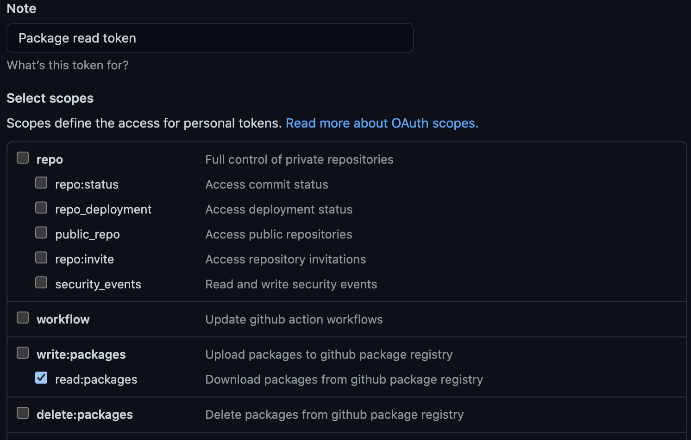

In 2019 Github launched their package registry as an alternative to current package registries such as [NPM](https://www.npmjs.com/) for JavaScript and RubyGems for... Ruby...

Github packages allows you to publish private or public packages for free. In this article we're going to be looking at the private packages for JavaScript side of things and how you can use them in your project workflows and the current downsides that you may encounter along the way. Github packages and the recent addition of Github Actions unlocks the ability for you to now manage your projects code, build and deploy packages and test/publish your project all within the same ecosystem without need for any third party CI system, build system or package registry, and the best part - it's free, well until you burn past the limits that Github sets which at the time of writing seem fairly generous. The current Github free tier allows

* Unlimited public/private repositories
* 2,000 Actions minutes/month (private repositories, public is free and unlimited)
* 500MB of GitHub Packages storage (again for private, public is free and unlimited)

That is more than enough to get you going on some of your projects whereas NPM would cost you $7/month for private packages, which even then is still cheaper than some of the previous options you had for hosting private packages such as Gemfury.

## How to install a Github hosted package into your project

Adding the ability for your project to use public and private Github packages is incredibly easy. First you'll need to create a `.npmrc` file at the root of your project, inside you'll need to add the URL for your package requests to be routed to i.e.

```javascript
//npm.pkg.github.com/:_authToken=${GITHUB_PKG_AUTH_TOKEN}

registry=https://npm.pkg.github.com/OWNER
```

The first line of the snippet above is required to authenticate you. For all public and private packages you'll need to use a Github personal access token to authenticate. This will allow you to publish/delete/install packages etc.

To setup a personal access token you'll need to login to Github and go to your [Personal access tokens settings](https://github.com/settings/tokens). Here you'll want to create a new token with only the required permissions. If you don't plan to publish or manage your own packages you can just set the `read:packages` scope but if you would like to publish packages then you'll need to also add the `write:packages` scope - simple enough.



Once you've created your token the best thing to do is to set it up as a variable in your environment such as within your bash profile or zsh profile. Add the line below and reload your profile or restart your terminal to ensure the changes take effect and the token ends up in your PATH.

```
export GITHUB_PKG_AUTH_TOKEN=YOUR-TOKEN-HERE
```

> Something to be aware of is that this token is currently scoped to allow read/write access to all packages your user has access to, including within any organisations you belong to - we'll come back to why this causes an issue in a moment.

If you're using mixing and matching packages from different Github users/organisations or if you're using Yarn then it's best to modify your `.npmrc` to scope your registry items to your org/user and change the url a little:

```
//npm.pkg.github.com/:_authToken=${GITHUB_PKG_AUTH_TOKEN}

@OWNER:registry=https://npm.pkg.github.com/
```

Notice the name of the owner is now not in the url but set as the scope of the registry url at the start of the line, this will allow you to use npm or Yarn correctly without any changes or need for a separate `.Yarnrc` file. Also notice that your GITHUB_PKG_AUTH_TOKEN is being read here so just ensure that the name there matches the name of your token in your zsh/bash/whatever profile.

That's it, you're now setup and ready to install a package into your project from the Github Package Registry. Go ahead and add a package to a project of yours.

```
npm i --save @my-github-org/my-package
```

## Using Github Packages with Github Actions

So now that we have our packages installing let's look at what that means when building our project using Github Actions specifically and what you need to be aware of with regards to authorisation and some pitfalls in the current way Github allows you to scope access tokens.

Firstly, an introduction to Github Actions

> [GitHub Actions](https://docs.github.com/en/actions/learn-github-actions/introduction-to-github-actions) help you automate tasks within your software development life cycle. GitHub Actions are event-driven, meaning that you can run a series of commands after a specified event has occurred

So with a very simple workflow defined in YAML living inside our repository at `/.github/workflows/build-deploy.yml` we can have Github run an action triggered by pushing to our main branch that

1. clones our repository
1. installs our modules
1. builds our project
1. deploys our project to github-pages

```yml
name: Build and Deploy
on:
  push:
    branches:
      - main
jobs:
  build-and-deploy:
    runs-on: ubuntu-latest
    steps:
      - name: Checkout 🛎️
        uses: actions/checkout@v2.3.1
        with:
          persist-credentials: false

      - name: Install and Build
        run: |
          npm ci
          npm run build
        env:
          GITHUB_PKG_AUTH_TOKEN: ${{ secrets.GH_PACKAGE_PAT }} # NOTICE ME

      - name: Deploy 🚀
        uses: JamesIves/github-pages-deploy-action@3.7.1
        with:
          GITHUB_TOKEN: ${{ secrets.GITHUB_TOKEN }}
          BRANCH: gh-pages # The branch the action should deploy to.
          FOLDER: dist # The folder the action should deploy.
          CLEAN: true # Automatically remove deleted files from the deploy branch

```

Everything above is fairly straight forward but notice that we have two 'secrets' defined in our workflows

* GITHUB_TOKEN
* GH_PACKAGE_PAT

GITHUB_TOKEN is a token that Github creates automatically within each repository - it's scoped to the current project which is great if the package we just added to our package.json file is published from the same repository but if it happens to be another repository then we're out of luck using this token to install our modules within the context of our action.

GH_PACKAGE_PAT is the token we setup and added to our zsh/bash profile above. This has access to read all packages in all repositories that our user has access to. You'll need to add this manually to your action secrets which you can find within your repository at [github.com/my-org/my-repository/settings/secrets/actions](github.com/my-org/my-repository/settings/secrets/actions) or you can add it globally to your organisation account at [https://github.com/organizations/my-org/settings/secrets/actions](https://github.com/organizations/my-org/settings/secrets/actions) which would allow it to be used in any of your repositories actions. Simple again your action will now correctly be able to access your Github hosted packages whether public or private and your builds will succeed (hopefully!). 

So what is the issue? Well there's a small issue here and it's do with limitations around Github's current access token scopes. Notice when you created your Github PAT that you were asked which organisation or which repositories you wanted this token to apply to. You don't? Well that's because you weren't and here's the limitation or possible risk that I see with this currently that may or may not reduce the usability for you or your organisation when it comes to Github Packages and Actions. All personal access tokens you create are scoped for all repositories for your user AND every single organisation that you're a member of. This means the moment you add your personal access token as a secret to a workflow or to your organisation you're actually giving away your account level access. This can be useful but it also means that for example if you're a member of two organisations and you have your token set in both orgs then Org A can read/write Org B's private packages and vice versa because of you! So that gets me sacked from Org A and all of a sudden all of their builds start failing with auth errors for their packages - well that's because my token is tied to the user Org A just removed from their organisation - me!

As you can no doubt see it's not a perfect way to manage scopes and can lead to issues for some people when using Github Actions - for most i'm sure it's not an issue but as with all security elements such as this you really need to evaluate the risk and mitigate it or in the example above, your staff leaving or moving on that can potentially end with a lot of maintenance work updating secrets and keys all over the place.

## Conclusion

We've looked at how to include Github registry packages into our projects, how we can then implement them into our Github Actions workflows and also what the implications of this are and the potential issues that may arise with the current limitation of the Github personal access token scopes.

A solution for the scopes issue would be for Github to allow access tokens to be scoped to repositories/organisations or even created at an organisation level but until then we'll just have to make do i'm afraid. It's a small issue personally for me and the company I work for right now but even then we had to decide whose token we should use and why and also going forward how this affects security when allowing people to create and deploy actions to our organisation.

